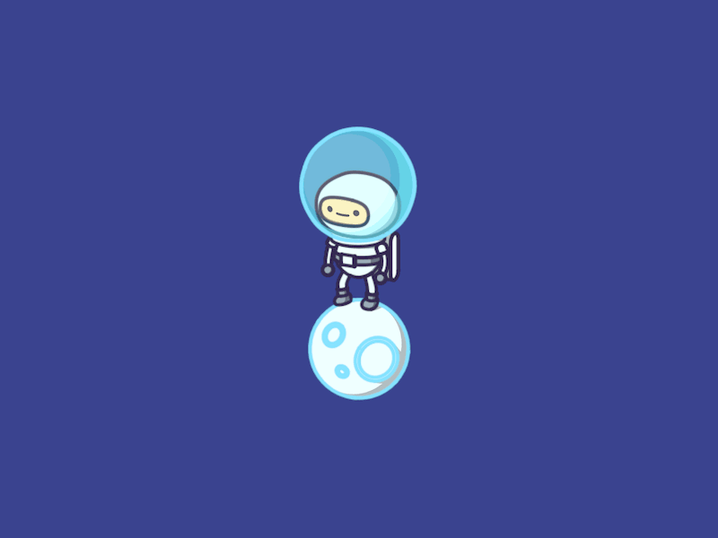

[![Contributors][contributors-shield]][contributors-url]
[![Forks][forks-shield]][forks-url]
[![Stargazers][stars-shield]][stars-url]
[![Issues][issues-shield]][issues-url]<br>
[](https://www.codacy.com?utm_source=github.com&amp;utm_medium=referral&amp;utm_content=AlQaholic007/Friend.ly&amp;utm_campaign=Badge_Grade) [](https://circleci.com/gh/AlQaholic007/Friend.ly) [](https://travis-ci.org/AlQaholic007/Friend.ly) [](http://hits.dwyl.com/AlQaholic007/Friend.ly)

<!-- PROJECT LOGO -->
<br />
<p align="center">
  <a href="https://github.com/AlQaholic007/AlQaholic007">
    
  </a>

  <h3 align="center">Friend.<span style="color: pink">ly</span></h3>

  <p align="center">
    A friend-recommendation system that utilizes sentiment analysis and personality trait extraction for recommendations!
    <br />
    <a href="https://github.com/AlQaholic007/Friend.ly/issues">Report Bug</a>
    ·
    <a href="https://github.com/AlQaholic007/Friend.ly/issues">Feature Request</a>
  </p>
</p>

<!-- TABLE OF CONTENTS -->

## Table of Contents

- [About the Project](#about-the-project)
  - [Built With](#built-with)
- [Development](#develipment)
  - [Prerequisites](#prerequisites)
  - [Installation](#installation)
- [Roadmap](#roadmap)
- [Contributing](#contributing)
- [License](#license)
- [Contact](#contact)
- [Acknowledgements](#acknowledgements)

<!-- ABOUT THE PROJECT -->

## About The Project

<!--
[![Product Name Screen Shot][product-screenshot]](https://example.com)
-->

### Built With

This project would never have been possible without these wonderful frameworks and project.

- [Node.js](https://nodejs.org)
- [EJS](https://ejs.co)
- [Tron](https://github.com/AlQaholic007/Tron)
- [Watson APIs](https://github.com/watson-developer-cloud/node-sdk#readme)
- [DeepAI](https://deepai.org/machine-learning-model/nsfw-detector)
- [Socket.io](https://www.npmjs.com/package/socket.io)
  Friend.ly is a modified version of [Tron](https://github.com/AlQaholic007/Tron)!

<!-- GETTING STARTED -->

## Development

This is an example of how you may give instructions on setting up your project locally.
To get a local copy up and running follow these simple example steps.

### Prerequisites

Clone the repo and hit npm install.

- npm

```sh
npm install
```

### Startup

1. Clone the repo

```sh
git clone https:://github.com/AlQaholic007/Friend.ly
```

2. Install NPM packages

```sh
npm install
```

3. Create a .env file in home directory with valid credentials as follows

```
TWITTER_CONSUMER_KEY=<your_twitter_consumer_key>
TWITTER_CONSUMER_SECRET=<your_twitter_consumer_secret>
TWITTER_CALLBACK_URL=<your_twitter_callback_url>
GOOGLE_CLIENT_ID=<your_google_client_id>
GOOGLE_CLIENT_SECRET=<your_google_client_secret>
GOOGLE_CALLBACK_URL=<your_google_callback_url>
WATSON_API_KEY=<your_watson_api_key>
WATSON_API_VERSION=<your_watson_api_version>
WATSON_URL=<your_watson_url>
```

4. Start the project

```JS
npm start
```

<!-- ROADMAP -->

## Roadmap

See the [open issues](https://github.com/AlQaholic007/Friend.ly/issues) for a list of proposed features (and known issues).

<!-- CONTRIBUTING -->

## Contributing

Contributions are what make the open source community such an amazing place to be learn, inspire, and create. Any contributions you make are **greatly appreciated**.

1. Fork the Project
2. Create your Feature Branch (`git checkout -b feature/AmazingFeature`)
3. Commit your Changes (`git commit -m 'Add some AmazingFeature'`)
4. Push to the Branch (`git push origin feature/AmazingFeature`)
5. Open a Pull Request

<!-- LICENSE -->

## License

Distributed under the Apache 2.0 License. See `LICENSE.md` for more information.

<!-- CONTACT -->

## Contact

- Soham Parekh <[@AlQaholic007](https://github.com/AlQaholic007), [mail@sohamp.dev](mail@sohamp.dev)>
- Vidhi Mody <[@vidhi-mody](https://github.com/vidhi-mody),  vidhimody6@gmail.com>
- Vrushti Mody <[@vrushti-mody](https://github.com/vrushti-mody),  vrushtimody6@gmail.com>

Project Link: [https://github.com/AlQaholic007/Friend.ly](https://github.com/AlQaholic007/Friend.ly)

[contributors-shield]: https://img.shields.io/github/contributors/AlQaholic007/Friend.ly?style=flat-square
[contributors-url]: https://github.com/AlQaholic007/Friend.ly/graphs/contributors
[forks-shield]: https://img.shields.io/github/forks/AlQaholic007/Friend.ly?style=flat-square
[forks-url]: https://github.com/AlQaholic007/Friend.ly/network/members
[stars-shield]: https://img.shields.io/github/stars/AlQaholic007/Friend.ly?style=flat-square
[stars-url]: https://github.com/AlQaholic007/Friend.ly/stargazers
[issues-shield]: https://img.shields.io/github/issues/AlQaholic007/Friend.ly?style=flat-square
[issues-url]: https://github.com/AlQaholic007/Friend.ly/issues
[product-screenshot]: docs/img/screenshot.png
